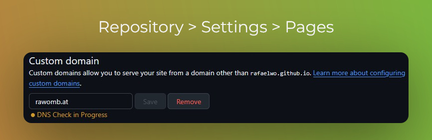

+++
date = '2025-07-13'
draft = false
title = 'How to build a website'
slug = 'how-to-build-a-website'
tags = ["website", "hugo", "dns"]
featuredImage = "/posts/build_a_website/young-tree.JPEG"
aliases = ['build_a_website']
+++

Most of us developers reach that point in time where we think:

> I should have a website/blog...

I'm not here to say that you *need* one. But creating and hosting a site is definitely a good learning experience (at least).
That's why I decided to write down what I have learned while creating [this very website](https://rawomb.at/).
The code is [available on GitHub](https://github.com/RafaelWO/website).

**In this post, you will learn how to build a website using Markdown and host it on
GitHub Pages using a custom domain.**

(If you already know how to create a website, feel free to jump to [my takeaways](#takeaways)🦘.)

## Where to start
If you are not a web developer (like me), the number of options you have to build a website can be quite overwhelming.
As I did not want to write it purely myself using plain HTML, CSS, and JavaScript, I decided to use [Hugo](https://gohugo.io), a static site generator that
builds websites based on a theme and some configuration. Then, I can focus on the content which I can write in [Markdown](https://en.wikipedia.org/wiki/Markdown).

The Hugo documentation has a great article on [how to get started in a few minutes](https://gohugo.io/getting-started/quick-start/).
After going through the quick start, you should have a basic site up and running locally.

## Theme
Now it is time for the most critical decision: Which theme do I use?

The good thing is that there are [a lot of themes out there](https://themes.gohugo.io/). Which can also be the bad thing.
Either way, picking a theme took me quite a while... I ended up with [Poison](https://themes.gohugo.io/themes/poison/) :skull:.

But feel free to experiment and try out different themes!
I guess you can also switch themes later on if you mainly added your content and did not change too many theme-specific things.

### Overriding theme templates
You might want to customize your theme of choice -- e.g., rearrange some elements in HTML, add new ones, or change the style in CSS.
For this, you don't need to fork the theme and add your fork as a submodule (yes... this is what I [did](https://github.com/RafaelWO/website/commit/d49e4438885e941548047f70f8653c91c4fa4559) :sos:).

Likely, you are better off[^1] by [overriding the template or partial](https://discourse.gohugo.io/t/could-someone-help-me-with-customize-theme-layout/49700/2?u=rafaelwo) that you want to change.
For this, create a template with the same path in the `layouts` directory in your project root. For example, to override
[`themes/poison/layouts/partials/post/info.html`](https://github.com/lukeorth/poison/blob/master/layouts/partials/post/info.html), create `layouts/partials/post/info.html` as a copy of the original file and modify it.

Same goes for CSS or JavaScript files --- except that those files are usually in the `assets` directory.
For example, you could overwrite `themes/poison-fork/assets/css/codeblock.css` by creating the file `assets/css/codeblock.css`.
Note that themes usually provide a documented way to add custom CSS, e.g., the [custom CSS file in Poison](https://github.com/lukeorth/poison?tab=readme-ov-file#custom-css)
or the [`customCSS` parameter in Coder](https://github.com/luizdepra/hugo-coder/blob/main/docs/configurations.md#theme-parameters).

## Favicon
You probably also want a favicon[^2] for your website. If you have an image of choice, it is very easy to generate all the favicon data you need.
For example, I used [RealFaviconGenerator](https://realfavicongenerator.net/). After uploading your image, you can adapt the size, background, and corners,
and specify the name under which your site will appear on mobile devices when added to the home screen.
Finally, use `/` for your Favicon path and download the ZIP file. Extract the contents into the `static/` folder (this will be copied to the root of your website).

You also need to add some `<link/>` tags in the `<head>` section for your site. For this, find the partial[^3] that creates the `<head>` and check if
it also specifies a favicon. Maybe your theme has a separate partial for the favicon, which you can [override](#overriding-theme-templates).
If you are curious how I did it, [here is the commit](https://github.com/RafaelWO/website/commit/d0972936fec329004d6d7001240623883722e4d5).

You can check whether your favicon is correctly configured later via a [favicon checker](https://realfavicongenerator.net/favicon-checker).

## Deployment and Hosting
The Hugo documentation includes articles on how to [host websites on various platforms](https://gohugo.io/host-and-deploy/).
Again, I wanted to keep it simple and decided to use [GitHub Pages](https://docs.github.com/en/pages/getting-started-with-github-pages/about-github-pages).

This is the point where you should have a GitHub repository with the code for your website.
You can either use a user/organization or a project repository[^4].

After pushing your code, follow the steps described in [Host on GitHub Pages](https://gohugo.io/host-and-deploy/host-on-github-pages/)
to create a GitHub Action that builds and publishes your site.
The next time you push changes to your repository's main branch, the site will be built for you
and should be up and running at `https://<username-or-org>.github.io` or `https://<username-or-org>.github.io/<repo-name>/`[^4]! 🐦‍🔥

## Custom Domain
You might want to host your site on a custom domain. Maybe you already own a domain or you want to buy one because you have a genius idea for
a domain name (this is me again :bear:). Either way, you can configure GitHub Pages to work with a custom domain.

There are two different types of domains you can use: apex domains and subdomains.
An apex domain (or base, bare domain) is a domain name that does not include any subdomains[^5]. This is typically the name of the domain you are buying, e.g., `python.org`.
A subdomain is --- as the name suggests --- a part of another domain, i.e. `docs` is a subdomain of `docs.python.org`.
Together with the apex domain, it forms the fully qualified domain name `docs.python.org`.
Note that `www` is also a subdomain.

One tip before you start messing around with your DNS configuration: the propagation of DNS records *can*
take up to 24 hours to complete. If you are used to getting instant feedback --- e.g., when you write code,
you usually can change something and run the program to get immediate feedback --- it can be hard to force
yourself to change one thing and then wait for some hours (usually it is faster).
Nevertheless, I recommend you to **be patient** with DNS configuration changes :hourglass:. Avoid making too many changes at once,
because that way you won't find out what setting you actually need.
While waiting, you can start with the write-up of your first post. Or spend some time off the computer.

### Verify your domain
Before you start configuring your repository to use a custom domain, I recommend [verifying it](https://docs.github.com/en/pages/configuring-a-custom-domain-for-your-github-pages-site/verifying-your-custom-domain-for-github-pages).
This ensures that only repositories owned by you can publish a GitHub Pages site to the verified custom domain.
Follow the documentation to add a TXT record in your DNS configuration of your hosting provider.

:exclamation:Some hosting providers will automatically add your domain to the end of the record.
For example, I first created the TXT record with the full name `_github-pages-challenge-rafaelwo.rawomb.at.`
but this resulted in the record name being `_github-pages-challenge-rafaelwo.rawomb.at.rawomb.at.`, i.e. the domain was duplicated.
Hence, I had to use the name without the domain: `_github-pages-challenge-rafaelwo`.

You can confirm the existence of the new record by running the [`dig`](https://linux.die.net/man/1/dig) command or an [online DNS checker](https://dnschecker.org/):

```sh
dig _github-pages-challenge-<username-or-org>.<your-apex.com> +nostats +nocomments +nocmd TXT
```

### Configuring your repository to use your domain
To configure Pages to use your custom domain instead of the default one, you first have to enter your domain in the
settings for Pages in your repository. The [GitHub docs](https://docs.github.com/en/pages/configuring-a-custom-domain-for-your-github-pages-site/managing-a-custom-domain-for-your-github-pages-site) describe this procedure for apex and subdomains.



If you use a GitHub Action for publishing (like the one from Hugo), use *GitHub Actions* as the source for the build and deployment of Pages.
Note that you [don't need a CNAME record in your GitHub repository](https://docs.github.com/en/pages/configuring-a-custom-domain-for-your-github-pages-site/troubleshooting-custom-domains-and-github-pages#cname-errors) if you use a GitHub Action to deploy your site.

Then, you have to add the following DNS record(s) in your domain/hosting provider's DNS settings.

**apex domain**
* `ALIAS` or `ANAME` record with name `@` (your root domain) and value `<username-or-org>.github.io.` (default domain of your site)  \
*OR* `A` records with name `@` and the [IP addresses for GitHub Pages](https://docs.github.com/en/pages/configuring-a-custom-domain-for-your-github-pages-site/managing-a-custom-domain-for-your-github-pages-site#configuring-an-apex-domain) as the value (one record per IP)
* (optional) `CNAME` record with name `www.<your-apex.com>.` and value `<username-or-org>.github.io.` (default domain of your site)
  * this automatically redirects from `www.<your-apex.com>` to `<your-apex.com>` if you configure the latter as your custom domain, or vice versa

**subdomain**
* `CNAME` record with name `<your.subdomain.com>.` and value `<username-or-org>.github.io.` (default domain of your site)

:exclamation:Notice the trailing dot/period `.` at the end of domain values.
This indicates a [complete or absolute domain name](https://datatracker.ietf.org/doc/html/rfc1034#section-3.1) and is required[^6] when creating DNS records.

You can confirm your DNS configuration via `dig`:

```sh
dig <your-apex.com> +nostats +nocomments +nocmd
# or
dig <your.subdomain.com> +nostats +nocomments +nocmd
```

Finally, go back to your repository settings for Pages and check the status of the DNS check.


Wait for the DNS check to pass. If it fails, although you correctly configured your DNS record,
try to *Remove* and add the domain again. (In my case, the DNS check failed on the day after
I configured my DNS records but this procedure fixed it.)

If you still have troubles with your custom domain, [check the documentation on troubleshooting
your custom domain][gh-pages-trouble].

I also strongly recommend to *Enforce HTTPS* by checking the corresponding box. Note that
you can only check the box after the DNS check is successful.

Otherwise, you are done! :cool:

### My DNS Configuration
| Name | Record type | Address | TTL |
| - | - | - | - |
| _github-pages-challenge-rafaelwo.rawomb.at. | TXT | 2424ab0b0c8fc97c5529cbe81b8894 | 3600 |
| rawomb.at. | A | 185.199.108.153 | 3600 |
| rawomb.at. | A | 185.199.109.153 | 3600 |
| rawomb.at. | A | 185.199.110.153 | 3600 |
| rawomb.at. | A | 185.199.111.153 | 3600 |
| www.rawomb.at. | CNAME | rafaelwo.github.io. | 3600 |

---

## Takeaways
* :bento: [Hugo](https://gohugo.io) makes it very easy to set up a static website and comes with a ton of [free themes](https://themes.gohugo.io/) to choose from
* :lipstick: Customize your theme by [overriding the template or partial](https://discourse.gohugo.io/t/could-someone-help-me-with-customize-theme-layout/49700/2?u=rafaelwo) instead of forking the theme -- unless you want to contribute to the theme, of course
* :money_with_wings: You can easily host your website for free using [GitHub Pages](https://docs.github.com/en/pages/getting-started-with-github-pages/about-github-pages).
If you use Hugo, check the [docs on how to deploy to Pages](https://gohugo.io/host-and-deploy/host-on-github-pages/)
* :white_check_mark: If you want to host your website on a custom domain, [verify it](https://docs.github.com/en/pages/configuring-a-custom-domain-for-your-github-pages-site/verifying-your-custom-domain-for-github-pages) first to mitigate domain takeovers
* :hourglass: Be patient with modifying your DNS configuration as changes can take up to 24 hours to propagate
* :repeat: If your GitHub pages DNS check is failing, try to remove and add your custom domain
* :face_with_spiral_eyes: Read the [troubleshooting documentation][gh-pages-trouble] if you have further issues with your custom domain and GitHub pages


[^1]: There is nothing wrong with forking a theme, e.g., to contribute to it, of course.
[^2]: This is the small icon that you see in an open tab in your browser.
[^3]: A partial is a template to render a component or part of your site (see also [docs](https://gohugo.io/templates/types/#partial)).
[^4]: See [types of GitHub Pages sites](https://docs.github.com/en/pages/getting-started-with-github-pages/what-is-github-pages#types-of-github-pages-sites).
[^5]: See [Wikipedia: Subdomain](https://en.wikipedia.org/wiki/Subdomain)
[^6]: Some providers might add the trailing dot automatically, e.g., [AWS Route 53](https://docs.aws.amazon.com/Route53/latest/DeveloperGuide/ResourceRecordTypes.html).

<!-- Links -->
[gh-pages-trouble]: https://docs.github.com/en/pages/configuring-a-custom-domain-for-your-github-pages-site/troubleshooting-custom-domains-and-github-pages
