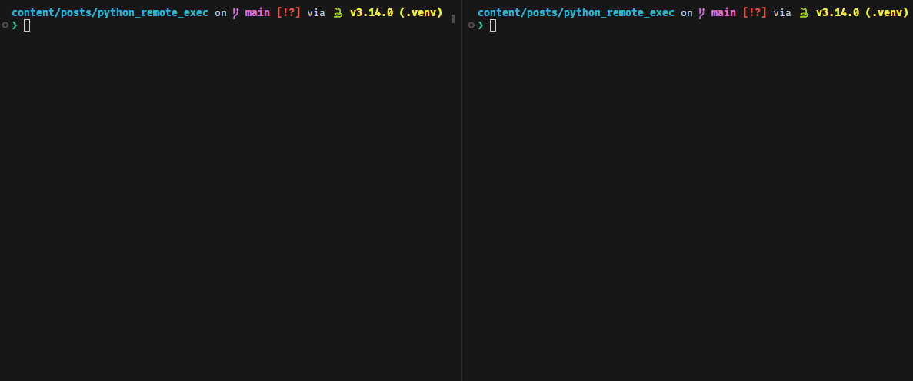

+++
date = '2025-12-28'
title = 'Execute Code in a Remote Python Process'
slug = 'python-remote-exec'
tags = ["python", "debugging", "pep"]
featuredImage = "/posts/python-remote-exec/insekt.jpg"
featuredImageFromMe = true
+++

Python 3.14 introduces [PEP 768][pep], a zero-overhead debugging interface that "_allows debuggers and profilers to safely attach to running Python processes without stopping or restarting them_" [[1]][whats-new]. One main application of this new feature is enabling [pdb][] to [attach][pdb-p] to live processes (via `pdb -p <pid>`), which allows interactive debugging of Python apps in real-time.

<!--more-->

If you want to learn more about the external debugger interface, I recommend [this talk][yt-video] from EuroPython 2025 by Pablo Galindo Salgado.

Besides `pdb -p`, the new interface allows "anyone"[^1] to execute arbitrary Python code within the context of another Python process by using the new API [`sys.remote_exec()`][sys-remote-exec]. This function takes a PID and the path to a script containing the code to be executed.
Upon calling, it writes the path to the "debug-script" into a specified spot in the memory of the remote process which will load and run the file the next time a safe evaluation point is reached.

This means you can write any Python code and execute it in a remote interpreter --- quite :cool:, right?

## Imagine
... you have some sort of Python web server that runs in production. Since you are a good software engineer, you added various logging statements using different levels to log what your running application is doing. But in production, you don't log on `DEBUG`, of course.

Now, you notice that your application logs errors but you lack the context of the error. Additional (debug) information which would greatly help to identify the causes, is not available. Too bad that we are not on the dev system...

What if you could temporarily change the log level to `DEBUG` to see what's really going on? No way, I would have to restart the app for that.

Guess what, with Python 3.14 there **is** a way! :top:

## Setup
First, create a virtual environment with Python 3.14. For this example, we will use the built-in `venv` module as it allows to use copies instead of symlinks[^2] (I will explain why we want this later).

```sh
$ uv run -p 3.14 python -m venv --copies .venv
$ source .venv/bin/activate
```

### Server
I created a minimal example of a server that logs an error and additional context in a debug message.



Let's start[^3] the server.

```sh
$ 𝜋thon server.py
INFO:main:Server started. PID: 8293
ERROR:main:An error occurred!
ERROR:main:An error occurred!
```

As expected, we see errors but we lack additional context.

(Note that this is a very simplified example. In reality, you should already give more context in the error message, of course. But there will always be useful information that is "hidden" in debug logs.)

Luckily, we now have a new weapon in our debug arsenal: Remote exec to the rescue! :safety_vest:

### Debugger
The following code is a mini-CLI tool that can change the log level of the `"main"` logger in a remote process to the level of choice.



Let's look into the most important parts of this code --- leaving the logic to set up `argparse` aside.

First, we write the Python code that we want to run in the remote process into a file.
In this case, we import the `logging` module, get the `"main"` logger, and set the log level to the input argument.



Then, we "inject" the code into the remote process:



The `sys.remote_exec` function will return immediately and the code will be executed by the target process at the next safe opportunity.

## Trial and error

### Attempt 1 - my user can do anything

Let's run the debug script:

```sh
$ python debug.py --log-level DEBUG -p 8293
Injecting script to change log level to DEBUG
Traceback (most recent call last):
  File "/home/rafael/repos/website/content/posts/python_remote_exec/debug.py", line 46, in <module>
    main(pid=args.pid, log_level=args.log_level)
    ~~~~^^^^^^^^^^^^^^^^^^^^^^^^^^^^^^^^^^^^^^^^
  File "/home/rafael/repos/website/content/posts/python_remote_exec/debug.py", line 22, in main
    sys.remote_exec(pid, script_path)
    ~~~~~~~~~~~~~~~^^^^^^^^^^^^^^^^^^
PermissionError: [Errno 1] Operation not permitted
```

Wait... what happened? :mag_right: It looks like we lack permissions. Let's take a look at the section _Permission requirements_ in the [_Remote debugging attachment protocol_ documentation][remote-debugging-proto]:

> Attaching to a running Python process for remote debugging requires elevated privileges on most platforms. The specific requirements and troubleshooting steps depend on your operating system:
>
> **Linux**
>
> The tracer process must have the CAP_SYS_PTRACE capability or equivalent privileges. (...)
> Try re-running the command with elevated privileges: `sudo -E !!`


(If you are on macOS or Windows, please check the [_Permission requirements_][remote-debugging-proto-prm] --- `sudo` should work on macOS.)

### Attempt 2 - use sudo, of course

Ok, let's try with `sudo`[^4]

```sh
$ sudo .venv/bin/python debug.py --log-level DEBUG -p 8293
Injecting script to change log level to DEBUG
Log level changed ✅
```

Cool, it worked! Or did it...? :telescope:

```sh
# Output of server.py
...
ERROR:main:An error occurred!
ERROR:main:An error occurred!
Can't open debugger script /tmp/tmpdh_kj9nu.py:
Traceback (most recent call last):
  File "/home/rafael/repos/website/content/posts/python_remote_exec/server.py", line 12, in main
    time.sleep(5)
PermissionError: [Errno 13] Permission denied: '/tmp/tmpdh_kj9nu.py'
ERROR:main:An error occurred!
```

Huh... I guess since we write the temporary file as `root`, the server process that runs under my user cannot read the file.

### Attempt 3 - why do I even have a user separate from root?

Running everything as root should fix the issue --- although this does not seem best practice.

```sh
$ sudo .venv/bin/python server.py
Server started. PID: 7195
ERROR:main:An error occurred!
ERROR:main:An error occurred!
```

```sh
$ sudo .venv/bin/python debug.py --log-level DEBUG -p 7195
Injecting script to change log level to DEBUG
Log level changed ✅
```

Looking at the logs of the server... it worked! :stars:

```sh
# Output of server.py
ERROR:main:An error occurred!
ERROR:main:An error occurred!
Changing log level to 'DEBUG' via remote exec...
DEBUG:main:This gives the missing context for the error.
ERROR:main:An error occurred!
DEBUG:main:This gives the missing context for the error.
ERROR:main:An error occurred!
```

<!--
Secret question: Why does it not work with `𝜋thon`? (attempt 3)

```sh
$ sudo .venv/bin/𝜋thon debug.py -p 7195 --log-level DEBUG
Injecting script to change log level to DEBUG
RuntimeError: Failed to find the PyRuntime section in process 6445 on Linux platform

The above exception was the direct cause of the following exception:

Traceback (most recent call last):
  File "/home/rafael/repos/website/content/posts/python_remote_exec/debug.py", line 46, in <module>
    main(pid=args.pid, log_level=args.log_level)
    ~~~~^^^^^^^^^^^^^^^^^^^^^^^^^^^^^^^^^^^^^^^^
  File "/home/rafael/repos/website/content/posts/python_remote_exec/debug.py", line 22, in main
    sys.remote_exec(pid, script_path)
    ~~~~~~~~~~~~~~~^^^^^^^^^^^^^^^^^^
RuntimeError: PyRuntime address lookup failed during debug offsets initialization
```
-->

## Finding better ways
You might have read the following part of the permission requirements for Linux:

> The tracer process must have the CAP_SYS_PTRACE capability (...)

This looks interesting! :monocle_face:	In Linux, [_capabilities_][capabilities] are distinct units of the "privileged features" that a process running under root has.
While a privileged process (e.g via `sudo`) bypasses all kernel permission checks, capabilities can be independently enabled and disabled, and are a per-thread attribute.

We can also associate a capability with an executable file.
This can be done via the `setcap` command on the Python executable (not the script!).

(By the way: This is why we used the `--copies` flag when creating the virtual environment in the beginning, because we don't want to mess with the "global" uv Python binary.)

Let's enable `CAP_SYS_PTRACE` for the Python executable:

```sh
sudo setcap 'CAP_SYS_PTRACE=ep' .venv/bin/python3
# You can remove it later via
# sudo setcap -r  .venv/bin/python3
```

The `e` stands for _effective_, `p` stands for _permitted_ --- please read the section "Thread capability sets" in the [man page][capabilities] to learn more.

You can view the file capabilities by running `getcap`

```sh
$ getcap .venv/bin/*
.venv/bin/python3 cap_sys_ptrace=ep
```

Let's start the server again using `python server.py` and the debugger using `python3 debug.py`. Note that we use `python` for the server, but `python3` for the debugger because this has the required capability which only the tracer process needs. :closed_lock_with_key:

### Final Demo


## Outlook
Besides remotely changing the log level of a running Python process, you can imagine other useful scenarios like
* :stethoscope: printing diagnostics in running web servers (e.g. active connections, open requests)
* :floppy_disk: examining in-memory caches or even clearing a cache variable
* :wastebasket: analyzing objects tracked by the garbage collector

In this post, we managed to execute code on another running Python process with a simple local setup: both the server and debugger run on a local dev machine. But how does this work in production? How can we poke around in processes running in a Docker container on a remote server? Or in a secure cloud environment? What about Kubernetes clusters?

Great questions, but for another time! :next_track_button:

The new interface for external debuggers elegantly solves a problem that debugging tools have had for a long time: "What is the point in time where it is safe to attach to a Python process?" Moreover, the PEP authors were so kind to add an API for us Python users to use this feature and execute code after attaching.

Now the door is open for a new era of debugging! :bug:

<!-- Footnotes -->
[^1]: You can read more about the required permissions [here][remote-debugging-proto-prm].
[^2]: There is a [feature request](https://github.com/astral-sh/uv/issues/6782) in `uv` to support copy or hard links when creating virtual environments.
[^3]: If you are not confused about how I start the server, just continue reading the post. Otherwise, read [this][secret-post].
[^4]: If I simply prefix `python ...` with `sudo`, it will not work because my user's environment variables, aliases, etc., are not carried over. Therefore, one solution is to specify the path to the Python executable explicitly.

<!-- Links -->
[pep]: https://peps.python.org/pep-0768/
[pdb]: https://docs.python.org/3/library/pdb.html
[pdb-p]: https://docs.python.org/3.14/library/pdb.html#cmdoption-pdb-p
[whats-new]: https://docs.python.org/3.14/whatsnew/3.14.html#pep-768-safe-external-debugger-interface
[sys-remote-exec]: https://docs.python.org/3.14/library/sys.html#sys.remote_exec
[remote-debugging-proto]: https://docs.python.org/3.14/howto/remote_debugging.html
[remote-debugging-proto-prm]: https://docs.python.org/3.14/howto/remote_debugging.html#permission-requirements
[capabilities]: https://www.man7.org/linux/man-pages/man7/capabilities.7.html
[yt-video]: https://youtu.be/w_NEFI_mqlo?si=n6pcK9T7KVF5l43a
[secret-post]: https://social.tchncs.de/@rafaelwo/115433992799465679
