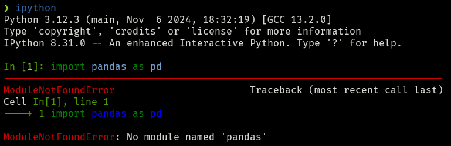
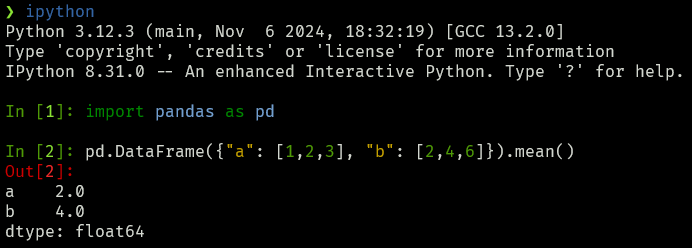
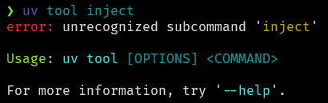

+++
date = '2025-01-25'
draft = false
title = "How to 'pipx inject' in uv"
slug = 'how-to-uv-inject'
tags = ["python", "uv", "pipx"]
series = "TIL"
aliases = ['uv_inject']
+++

Have you ever used `pipx inject`? It is the command to install a package into an existing pipx-managed virtual environment[^1].

### Pipx inject

Let's say you have installed the IPython interactive shell via `pipx install ipython` but
now you want to use `pandas` to do some data wrangling.

```bash
$ ipython
In [1]: import pandas as pd

```



To fix this, let's install `pandas` into the `ipython` environment:

```sh
pipx inject ipython pandas
```

Now we are good to go!



### But I use uv now...

If you mainly use `uv` and using `uv tool` to manage your Python app, you might have noticed
that `uv tool inject` does not exist.



So how can we "inject" a package into an app installed via uv? You need to add your additional
dependencies during the install command via `--with [package]`[^2]:

```sh
uv tool install --with pandas ipython
```

Et voilà!


[^1]: https://pipx.pypa.io/latest/#inject-a-package
[^2]: This might look familiar to you if you ever have used `uv run --with [...]`
